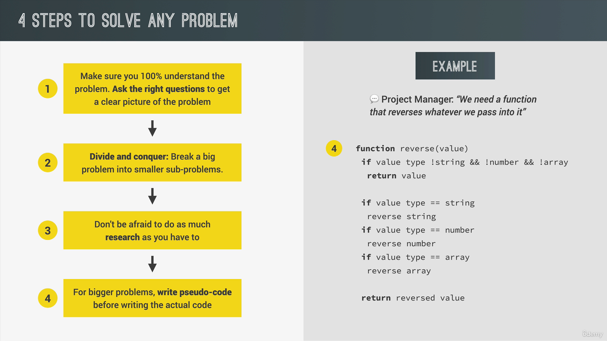

## Functions

```
function describeCountry(country, population, capitalCity) {
    console.log(`${country} has ${population} million people and its capital city is ${capitalCity}`)
}

describeCountry('USA',320,'Washington D.C')
```

## Function Declarations and Expressions

```
function percentageOfWorld1(country,population) {
    percentage = (population/7900)* 100
    console.log(`${country} has a ${population} million people, so it's about ${percentage}% of the world population`)
}

China = percentageOfWorld1('China',1441)
India = percentageOfWorld1('India',1552)
USA = percentageOfWorld1('USA',320)

function percentageOfWorld2(country,population) {
    percentage = (population/7900)* 100
    console.log(`${country} has a ${population} million people, so it's about ${percentage}% of the world population`)
}

Brazil = percentageOfWorld2('Brazil',216)
Bangladesh = percentageOfWorld2('Bangladesh',172)
Russia = percentageOfWorld2('Russia',144)
```

## Arrow Function

```
const percentageOfWorld3 = (country, population) => console.log(`${country} has ${population} million people, so it's ${(population/7900) * 100} percentage of world population`);
percentageOfWorld3('China',1441)
```

## Functions Calling Other Functions

```
function percentageOfWorld1(country,population) {
    percentage = (population/7900)* 100
}

function describePopulation(country,population) {
    percentageOfWorld1(country,population)
    console.log(`${country} has a ${population} million people, so it's about ${percentage}% of the world population`)
}

China = percentageOfWorld1('China',1441)
```

## Introduction to Arrays

```
function percentageOfWorld1(population) {
    percentage = (population/7900)* 100
    return percentage
}

// Function is working
// console.log(percentageOfWorld1(1428))

// Population Array
let populations = [1428,1425,339,277];
// console.log(populations)

// Calculating the length of the array
console.log(populations.length === 4);

// Calculating the percentage of population from each element of populations array
let percentages = [percentageOfWorld1(populations[0]),percentageOfWorld1(populations[1]),percentageOfWorld1(populations[2]),percentageOfWorld1(populations[3])]
console.log(percentages)
```

## Basic Array Operations

```
// Neighbors array
neighbors = ['Pakistan', 'Nepal', 'Bhutan'];
console.log(neighbors)

// Adding Utopia to array
neighbors.push('Utopia');
console.log(neighbors)

// Removing Utopia from the array
neighbors.pop('Utopia')
console.log(neighbors)

// Checking if Germany is in the array
if (neighbors.includes("Germany")) {
    console.log("European Country")
}
else {
    console.log("Probably not a European Country")
}

// Replacing a country with Sweden in the array
neighbors.splice(0,1,'Sweden')
console.log(neighbors)

// Replacing Sweden with Republic of Sweden
neighbors[neighbors.indexOf('Sweden')] = 'Republic of Sweden'
console.log(neighbors);
```

## Introduction to Objects

```
const myCountry = {
    country: 'India',
    capital: 'Delhi',
    language: 'telugu',
    population: 1400,
    neighbors: ['Pakistan','Bangladesh','Nepal','Bhutan']
}
```

## Dot vs Bracket Notation

```
const myCountry = {
    country: 'India',
    capital: 'Delhi',
    language: 'telugu',
    population: 1400,
    neighbors: ['Pakistan','Bangladesh','Nepal','Bhutan'],
    output: function() {
        return(`${this.country} has ${this.population} million ${this.language} speaking people, ${this.neighbors.length} neighboring countries and a capital called ${this.capital}.`)
    }
}

console.log(myCountry.output())
```

```
// Dot Notation
myCountry.population += 200;
console.log(myCountry.population)
```

```
// Bracket Notation
myCountry["population"] -= 200;
console.log(myCountry.population)
```

## For Loop

```
for (let i=0; i<=50; i++) {
    console.log(`Voter ${i} is currently voting!`)
}
```

## Looping Arrays, Breaking and Continuing

```
let populations = [1428,1425,339,277];
let percentages2 = [];

// Percentage Function
function percentageOfWorld1(population) {
    percentage = (population/7900)* 100
    return percentage
}

for (let i=0; i<populations.length; i++) {
    percentages2.push(percentageOfWorld1(populations[i]))
}

console.log(percentages2)
```

## Looping Backwards and Loops in Loops

```
let listOfNeighbours = [
    ['Canada', 'Mexico'],
    ['Spain'],
    ['Norway', 'Sweden','Russia']];

for (let i=0; i<listOfNeighbours.length; i++)
    for (let y=0; y<listOfNeighbours[i].length; y++)
        console.log(`Neighbour: ${listOfNeighbours[i][y]}`)
```

## The While Loop

```
let populations = [1428,1425,339,277];
let percentages3 = [];

// Percentage Function
function percentageOfWorld1(population) {
    percentage = (population/7900)* 100
    return percentage
}

i=0
while(i <populations.length) {
    percentages3.push(percentageOfWorld1(populations[i]));
    i++;
}

console.log(percentages3)
```

## Think like a Developer



## Debugging Coding Challenge

```
// 1. Array is given
// 2. A function takes the array
// 3. the function performs the operation we ask it to do until each element in an array

// Write the Function
const printForecast = function(arr) {
    let str = '';
    for(let i=0; i<arr.length; i++) {
        str = str + ` ${arr[i]} in ${i + 1} days ... `
        //str += ` ${arr[i]} in ${i + 1} days ... ` Alternative
    }
    console.log('...' + str);
    return 'completed';
}

console.log(printForecast([17, 21, 23]));
console.log(printForecast([12, 5, -5, 0, 4]));
```
